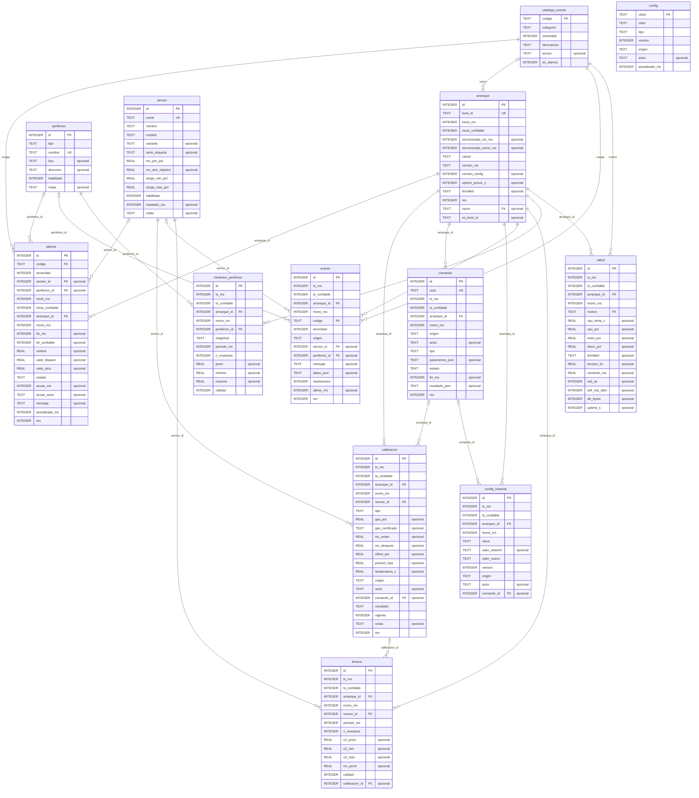
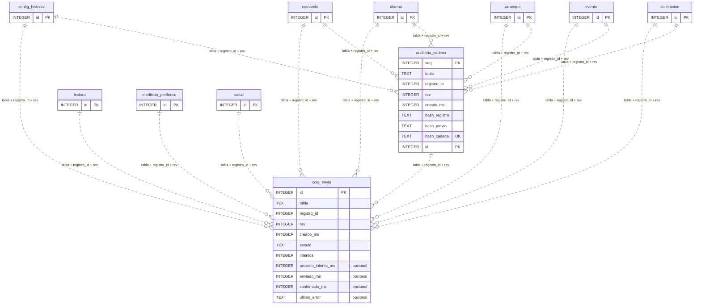

# G2 — Diagrama entidad-relación de la base de datos

> Generado por `tools/generar_diagrama_er.py` desde el esquema real (migraciones 001 a 004).
> No editar a mano: se regenera después de cada migración. GitHub dibuja los diagramas
> directamente; en VS Code se ven con la extensión *Markdown Preview Mermaid Support*.

**Cómo leerlo:** `PK` clave primaria, `FK` clave foránea, `UK` valor único, *opcional* = acepta
vacío. Las líneas muestran de quién depende cada tabla: un círculo (`o`) en el lado del padre
significa que la referencia es opcional; las patas de gallo (`{`) marcan el lado "muchos".

## 1. Modelo de datos (claves foráneas)

Notas:
- `arranque` es la raíz de la trazabilidad: casi todo registro apunta al arranque del núcleo
  que lo generó (`arranque_id`), con la versión de software y de configuración de ese momento.
- `lectura` guarda un agregado por intervalo (promedio, mínimo, máximo) y la calibración
  vigente al medir (`calibracion_id`).
- `alarma` y `evento` usan códigos de `catalogo_evento`; `salud.motivo` también.
- `config` guarda el valor vigente de cada clave; `config_historial` cada cambio, con su origen
  y, si vino de la plataforma o la pantalla, el `comando` que lo pidió.
- `esquema_version` (control de migraciones) no se dibuja: no se relaciona con nada.

## 2. Mecanismos transversales (referencias lógicas, no claves foráneas)

`cola_envio` y `auditoria_cadena` apuntan a otras tablas por el par `tabla` + `registro_id`
(y `rev`), no por una clave foránea, porque cada una sirve a varias tablas. Las líneas
punteadas lo indican. Los disparadores de la base mantienen ambos mecanismos (ver
`001_esquema_inicial.sql` y `003_cadena_auditoria.sql`):

- **cola_envio:** todo registro sincronizable se encola solo, y no se puede borrar hasta que
  la plataforma confirme que lo almacenó (D-008, D-010).
- **auditoria_cadena:** cada creación o revisión de un registro auditado agrega un eslabón con
  la huella SHA-256 encadenada con la del eslabón anterior (D-016).

